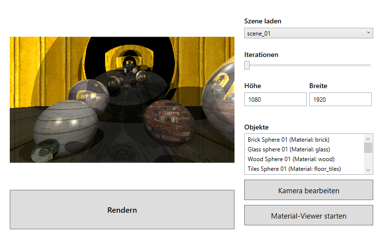
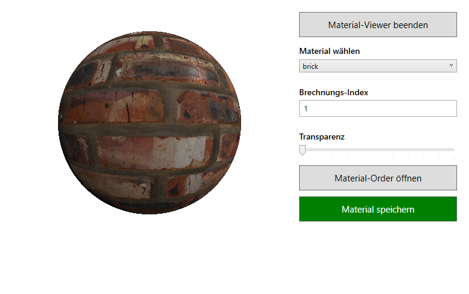
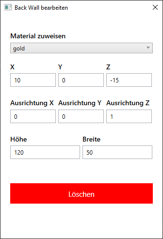

A simple ray tracer implemented in a two-week pair-project phase.

# Features
- Diffuse lighting using Lambert's cosine law
- Specular highlights using Blinn-Phong
- Shadows
- Transparency (adjustable)
- Recursive reflections (recursion depth adjustable)
- refraction using Snell's law
- Shapes with adjustable dimensions
    - Spheres
    - Axis-aligned finite planes
- Texturing
- Point lights with adjustable brightness
- Camera with adjustable FOV
- Parallelized rendering on Linux
- Scene configuration in json files
- Simple scene configurator and material editor implemented with the GUI framework WPF

## GUI
### Main Window

- Scene loader
- Adjustable image dimensions
- Material list, opens a material editor upon clicking
- Button to open the camera editor
- Button to open the material-viewer-editor
- Render Button

### Material editor

- Button to close the material viewer
- Material selector
- Input field for refractive index
- Slider for transparency
- Button to open folder of material
- Button to save changes to the material config

### Object editor

- Material selector
- Input fields for the object's position
- Shape specific dimensions (e.g. for planes:input fields for the orientation of the plane and the dimensions)
- Button to remove the object from the scene

# License

Copyright (C) 2021 [Jonas Muehlmann](https://github.com/JonasMuehlmann), [Tim Dreier](https://github.com/RageTimmy)

The project is licensed under the terms of the MIT license, you can view it [here](LICENSE.md).